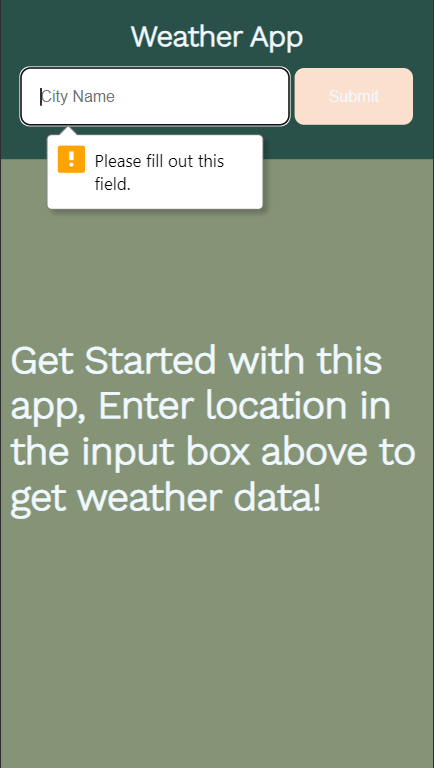
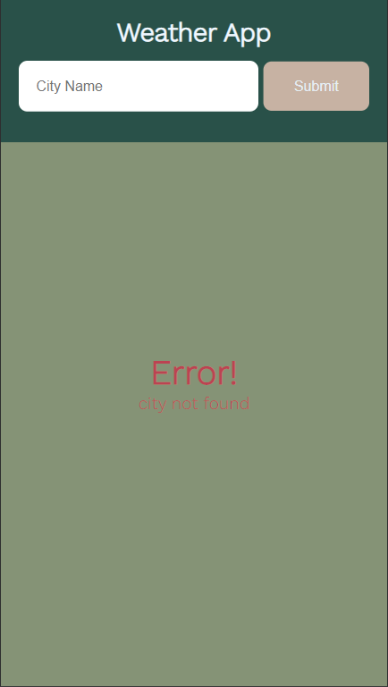

<h1 align="center">
<br>
<a title="Weather App Logo" href="https://github.com/shivang02/weather-app"></a>
<br>
  Weather App
  <br>
</h1>

<h4 align="center">A Node Js application to get real time weather data of a city.</h4>

<div align="center" style= "display:flex; align-items:center;justify-content:center">
<code></code>
<span>&nbsp;&bull;&nbsp;</span>
<code></code>
<span>&nbsp;&bull;&nbsp;</span>
<code></code>
<span>&nbsp;&bull;&nbsp;</span>
<code></code>
<span>&nbsp;&bull;&nbsp;</span>
<code></code>
</div>
<p align="center">
  <a href="#screenshots">Screenshots</a> •
  <a href="#how-to-use">How To Use</a> •
  <a href="#license">License</a>
</p>


## Screenshots

- **Desktop**<br>
  - Landing<br><br>

<br><br>
  - On Blank Submission<br><br>

<br><br>
  - On Succesful Submission<br><br>

<br><br>
  - On Error<br><br>

<br><br>
  - 404 page<br><br>

<br><br>

- **Mobile**<br>
  - Landing<br><br>

<br><br>
  - On Blank Submission<br><br>

<br><br>
  - On Succesful Submission<br><br>

<br><br>
  - On Error<br><br>

<br><br>
  - 404 page<br><br>

<br><br>

## How To Use
You need <a href="https://nodejs.org>Node.js</a> installed to run this app.
Clone this repository and open index.html<br>
From your command line:

```bash
# Clone this repository
$ git clone https://github.com/shivang02/weather-app

# Go into the repository
$ cd weather-app

# Install node_modules
$ npm install

# Run the app
$ npm start
```

## License

MIT

---

> GitHub &nbsp;&middot;&nbsp; [@shivang02](https://github.com/shivang02)
